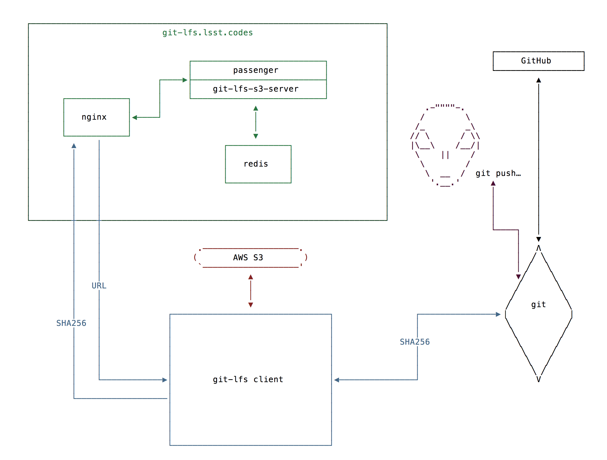

This is a SQuaRE Technical Note describing the architecture of the `Git LFS <https://git-lfs.github.com/>`_ service implementation. For actual
documentation on deployment, as well as the source code involved in
standing up this service, consult the :ref:`repositories <repos>`.

Motivation
==========

Astronomical software code repositories often contain data for test or
demo purposes. These large binary files don't tend to benefit from
version control beyond provenance and update tracking, and their
history expands repository size with no return. Historically there
have been a number of services to deal with this, such as `git-annex`_
and `git-fat`_, but in terms of workflow, storing files in those back
ends was too much of a departure from what seems like "normal"
workflow for users. Lacking a satisfactory option, the core package
`afwdata`_ was left on the in-house gitolite server after the rest of the
codebase migrated to GitHub.

.. _git-annex: http://www.git-annex.org
.. _git-fat: https://github.com/jedbrown/git-fat
.. _afwdata: https://github.com/lsst/afwdata

In 2015, `GitHub released a protocol and an open source reference
implementation of Git LFS <https://git-lfs.github.com>`_, a
specification for dealing with large binary files in git. Aside from
some upfront setup pain, the workflow was very close to "normal" GitHub
flow. GitHub also released a paid hosted service for those files. Given
the demand for storing data in our repositories, the cost would be
non-trivial. More, we did not wish to get in a position where developers
are self-censoring over what to store.

Following `a successful RFC
<https://jira.lsstcorp.org/browse/RFC-104>`_, we decided to proceed with
a Git LFS service. This would give users the advantages of working
predominantly with the GitHub services, while allowing us to offer
unmetered storage at the back end.

Architecture
============



After `installing <https://git-lfs.github.com>`_ the ``git lfs`` client,
a user can commit additions and modifications to LFS-backed data using
the normal ``git`` commands. The repo's ``.gitattributes`` specifies
what files are tracked by Git LFS. When the user pushes commits with
LFS-tracked data, they are in fact generating two requests. The first
one goes to the Git server containing the Git LFS pointer for the
file. It looks something like this:

.. code-block:: text

   version https://git-lfs.github.com/spec/v1
   oid sha256:7a6943ac4d8337727b93f410cf51b1ce748dabe9dc8e85c8942c97dd5c0a49e9
   size 123840

The second request is made by the ``git lfs`` client (due to the
smudge and clean filters) and uses the ``.lfsconfig`` to locate
the Git LFS server it should be addressing. In our case that is
``git-lfs.lsst.codes``. The Git LFS server checks whether the requested
blob exists in the backing store, and hands the client a URL that it
can use to retrive or push it. If the request requires authentication
and authorization then the Git LFS server queries the GitHub API to
ensure the user is an `LSST org member <https://github.com/lsst>`_ (we
can't let anyone on the open Internet push to our server!). The client
then uses the URL to fetch or push to our object store.

Other ``git-lfs.lsst.codes`` components:

- `Passenger <https://www.phusionpassenger.com>`_ is used to run the
  ``git-lfs-s3-server`` ruby gem,
- `Nginx <http://nginx.org>`_ is used for SSL termination,
- `Redis <http://redis.io>`_ is used for credential caching,

The object store components are:

- The `AWS S3 service <https://aws.amazon.com/s3/>`_, that provides a
  REST API to their object storage service.

.. _repos:

Client Requirements
===================

The LSST Git LFS system requires a `minimum ``git-lfs`` client version
of 1.1.0 <https://github.com/git-lfs/git-lfs/releases/tag/v1.1.0>`_.
This is the minimum client version to support ``.lfsconfig``
configuration.

SQuaRE's continuous integration system uses ```git-lfs`` client version
1.5.5 <https://github.com/git-lfs/git-lfs/releases/tag/v1.5.5>`_. This
version supports both `the batch API <https://github.com/git-lfs/git-lfs/blob/master/docs/api/batch.md>`_ and `the legacy API <https://github.com/git-lfs/git-lfs/blob/f2678fc8304b1a570dd12489a388831dc01fae49/docs/api/http-v1-original.md>`_.

It is recommended that users use the `current stable ``git-lfs`` client
version <https://github.com/git-lfs/git-lfs/releases/latest>`_. Newer
client versions support the more efficient batch API and have many bug
fixes and performance improvements.

Repositories
============

These are the repos involved in this deployment:

- `git-lfs-s3-server <https://github.com/lsst-sqre/git-lfs-s3-server>`_

  This is the server implementation. It also contains the deploy
  instructions. 
  
- `git-lfs-s3 <https://github.com/lsst-sqre/git-lfs-s3>`_

  This is a fork that we made of an LFS S3 implementation. We extended
  it because it lacked support for `the git-lfs batch API
  <https://github.com/git-lfs/git-lfs/blob/master/docs/api/batch.md>`_.

.. _docs:

Documentation
=============

- `GitHub's Git Large File Storage website <https://git-lfs.github.com/>`_

  This is GitHub's git-lfs website and links to the canonical client
  source code, issues and documentation.
  
  Because this was the first (and main) repo transitioned,
  user-oriented notes can be found in afwdata's README. As this
  service is extended, it will be rehomed.

- `LSST's developer guide <http://developer.lsst.io/en/latest/tools/git_lfs.html>`_

  LSST's developer guide for using git-lfs.

- `SQuaRE Technical Note 001 <https://github.com/lsst-sqre/technote-001>`_

  The source for this note.

RFCs
====

- `RFC-104 <https://jira.lsstcorp.org/browse/RFC-104>`_

  This is the RFC proposing Git LFS adoption.
